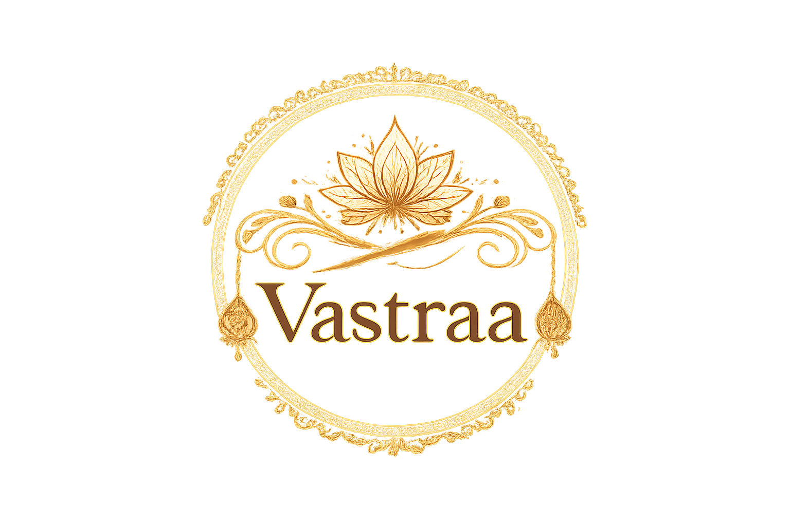
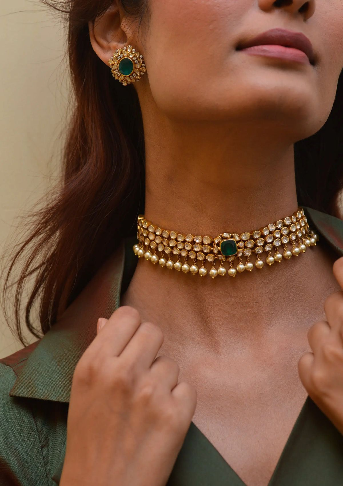
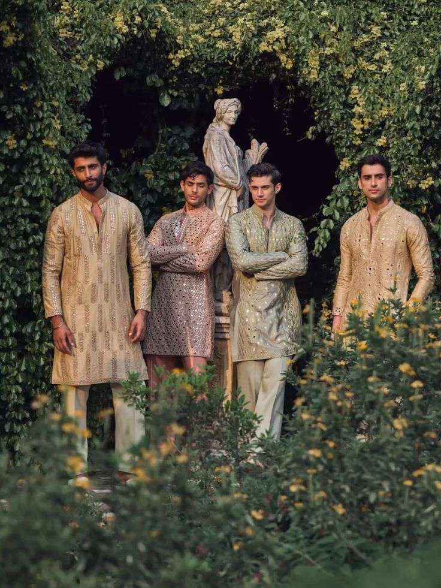
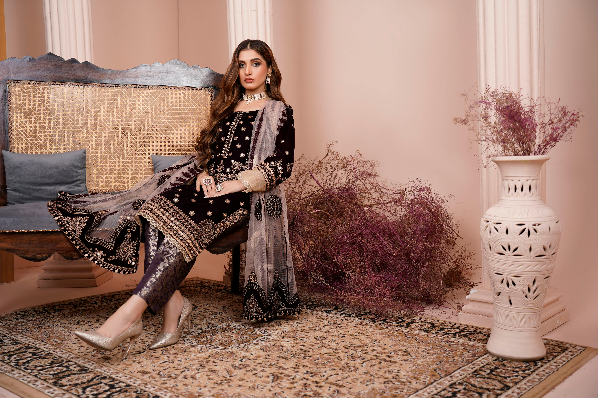
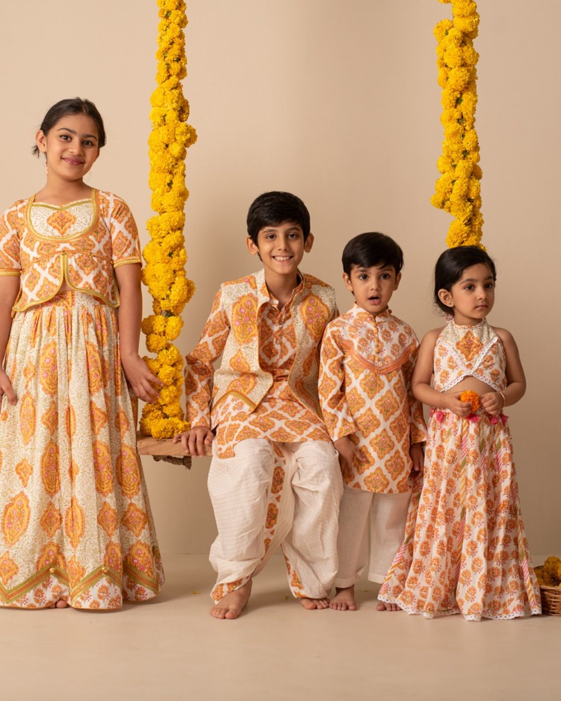

# 👘 Vastraa - Ethnic Wear E-Commerce Website

A complete **E-Commerce Website** for ethnic wear including **Men, Women, Kids** clothing with accessories. Built with **HTML, CSS, JavaScript** and **Python Flask** backend with **SQLite** database.

---

## 🌟 Features

### 👕 **Product Categories**
- 👨 **Men's Collection** - Sherwani, Kurta Pajama, Nehru Jacket, Indo-Western
- 👩 **Women's Collection** - Sarees, Lehenga, Anarkali Suits, Kurtis, Plazo Sets
- 👧 **Kids Collection** - Kurta Pajama, Lehenga Choli, Dhoti Kurta
- 💍 **Accessories** - Jewelry, Footwear, Bags

### 🛒 **E-Commerce Features**
- Product Listing with Images
- Add to Cart Functionality
- User Login/Signup System
- Product Search
- Category Filters
- Wishlist
- Order Management

### 👤 **User Features**
- User Registration & Login
- Profile Management
- Order History
- Cart Management
- Feedback System

### 🔧 **Technical Features**
- Responsive Design (Mobile Friendly)
- SQLite Database
- Python Flask Backend
- Modern UI/UX
- Fast Loading

---

## 🚀 Live Demo

> **Website:** [Coming Soon]
> 
> **GitHub:** [zeelprajapati-dev/vastraa](https://github.com/zeelprajapati-dev/vastraa)

---

## 📸 Screenshots

### Home Page

### Men's Collection

### Women's Collection

### Kids Collection

---

## 🛠️ Technologies Used

| Technology | Purpose |
|------------|---------|
| **HTML5** | Structure of website |
| **CSS3** | Styling and animations |
| **JavaScript** | Interactive features |
| **Python Flask** | Backend server |
| **SQLite** | Database |
| **Bootstrap** | Responsive design |
